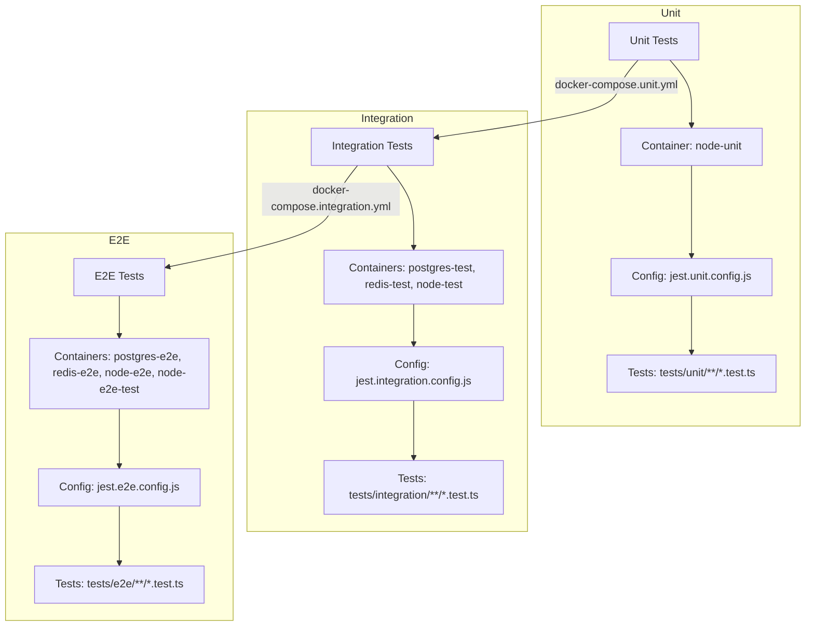

## Testes end-to-end no CI

Este projeto demonstra o uso de testes unitários, testes de integração e testes end-to-end em uma aplicação Node.js/TypeScript com Express, incluindo:

- Banco de dados PostgreSQL
- Redis para blacklist de tokens
- Autenticação com JWT
- Docker/Docker Compose para isolar os recursos de teste
- Jest + Supertest para escrever e executar os testes automatizados
- GitHub Actions para o pipeline de CI


---

### Testes end-to-end

Testes End-to-End validam um fluxo completo de negócio do ponto de vista do usuário (humano ou sistema externo), exercitando todas as camadas relevantes da aplicação: interface (UI ou API), backend, banco de dados, cache, fila, etc.
A pergunta que um E2E responde é:
*“Quando alguém usa o sistema para realizar X, o resultado ocorre como esperado?”*

No nosso projeto (API Node.js/Express com PostgreSQL e Redis), um E2E típico seria:
1. Registrar usuário (POST /users);
2. Efetuar login (POST /users/login) e receber o JWT;
3. Acessar rota protegida usando o JWT – mudar a própria senha (PATCH /users/password);
4. Efetuar logout (POST /users/logout) e validar que o token foi blacklistado (Redis) e não funciona mais.
Esses passos percorrem o sistema “de ponta a ponta”: desde a entrada HTTP até a persistência (Postgres) e a camada de segurança/estado (Redis).


### 📌 Objetivo

- Mostrar boas práticas em testes unitários, de integração e de ponta a ponta.
- Isolar os testes em pastas dedicadas (tests/unit, tests/integration, tests/e2e).
- Configurar Postgres e Redis de forma efêmera com Docker para os testes de integração/E2E.
- Validar fluxos de autenticação (login, logout, blacklist de tokens) de ponta a ponta.
- Integrar o pipeline de testes ao GitHub Actions usando Docker Compose.


---

### 🧑‍💻 Tecnologias Utilizadas

- Node.js + TypeScript – aplicação principal
- Express – servidor HTTP
- PostgreSQL – banco de dados
- Redis – armazenamento da blacklist de tokens JWT
- Docker + Docker Compose – orquestração dos serviços de teste
- Jest – framework de testes
- Supertest – simulação de requisições HTTP para testes de integração/E2E


---

### 📂 Estrutura de Pastas

```bash
app/
├── .github/
│   └── workflows/
│       └── ci.yml
│
├── db/                     
│   └── init.sql 
│
├── server/  
│   ├── src/                     # Código da aplicação
│   │   ├── configs/             # Conexão com Postgres e Redis
│   │   ├── controllers/         # Controllers (ex: user.controller.ts)
│   │   ├── middlewares/         # Middlewares (auth, validação, erros)
│   │   ├── routes/              # Rotas Express
│   │   ├── types/               # Tipagem customizada
│   │   ├── utils/               # Funções auxiliares (ex: JWT)
│   │   └── index.ts             # Inicialização do servidor
│   ├── tests/                   # Casos de teste (isolados da aplicação)
│   │   ├── e2e/
│   │   │   ├── api.e2e.test.ts
│   │   │   ├── infra.e2e.test.ts
│   │   │   └── user.e2e.test.ts 
│   │   ├── integration/
│   │   │   ├── controllers/         # Testes de controllers com Supertest
│   │   │   │   └── user.controller.test.ts
│   │   │   └── helpers/             # App de teste sem app.listen()
│   │   ├── unit/
│   │   │   ├── controllers/ 
│   │   │   │   └── user.controller.test.ts
│   │   │   ├── middlewares/ 
│   │   │   │   ├── authMiddleware.test.ts
│   │   │   │   ├── errorHandler.test.ts
│   │   │   │   └── validateBody.test.ts
│   │   │   └── utils/ 
│   │   │       └── jwt.test.ts
│   │   │    
│   │   ├── jest.integration.setup.ts
│   │   └── jest.unit.setup.ts
│   │
│   ├── Dockerfile.e2e
│   ├── Dockerfile.integration
│   ├── Dockerfile.production
│   ├── Dockerfile.unit
│   ├── jest.integration.config.js
│   ├── jest.e2e.config.js
│   ├── jest.unit.config.js
│   └── package.json
│
├── .dockerignore
├── .env.e2e
├── .env.integration
├── .env.production
├── docker-compose.e2e.yml
├── docker-compose.integration.yml
├── docker-compose.production.yml
└── docker-compose.unit.yml

```


---

### ▶️ Execução Local


1. Clonar o repositório e instalar dependências:

```bash
git clone https://github.com/arleysouza/e2e-test.git app
cd app
```

2. Subir containers para rodar a aplicação em modo de produção:
```bash
docker compose -f docker-compose.production.yml up --build -d
```
Encerrar e remover containers:
```bash
docker compose -f docker-compose.production.yml down -v
```
O arquivo `/http/requests.http` contém as requisições da aplicação (login, registro, logout, change password).
Para executá-las diretamente no VSCode, instale a extensão:
👉 REST Client (autor: Huachao Mao)
Após instalar, basta abrir o arquivo `requests.http`, clicar em `Send Request` sobre a requisição desejada, e o VSCode mostrará a resposta no editor.

3. Testar a API no VSCode:

- O arquivo `/http/requests.http` contém requisições de exemplo.
- Instale a extensão **REST Client (Huachao Mao)**.
- Abra o arquivo, clique em `Send Request` e veja a resposta no editor.


4. Rodar testes unitários:
```bash
docker compose -f docker-compose.unit.yml up --build -d
```
Encerrar e remover containers:
```bash
docker compose -f docker-compose.unit.yml down -v
```


5. Rodar testes de integração:
```bash
docker compose -f docker-compose.integration.yml up --build -d
```
Encerrar e remover containers:
```bash
docker compose -f docker-compose.integration.yml down -v
```

6. Rodar testes end-to-end:
```bash
docker compose -f docker-compose.e2e.yml up --build -d
```
Encerrar e remover containers:
```bash
docker compose -f docker-compose.e2e.yml down -v
```


---

### Fluxo de Execução dos Testes

Nosso projeto contém três camadas de testes: unit, integration e e2e. Cada uma possui responsabilidades, containers Docker e arquivos de configuração específicos.

#### 1. Testes unitários

Objetivo: validar funções isoladas, sem dependências externas.

- Compose: `docker-compose.unit.yml`
- Dockerfile: `server/Dockerfile.unit`
- Script executado: `npm run test:unit`
- Configuração Jest: `server/jest.unit.config.js`
- Setup Jest: `server/tests/jest.unit.setup.ts`
- Escopo dos testes: `server/tests/unit/**/*.test.ts`

Os testes rodam apenas dentro de um container Node.js (`node-unit`).
Como o objetivo é testar as funções isoladamente, os testes substituem as conexões com o Postgres e Redis por mocks.


#### 2. Testes de integração 

Objetivo: verificar se módulos diferentes funcionam corretamente em conjunto.

- Compose: `docker-compose.integration.yml`
- Dockerfile: `server/Dockerfile.integration`
- Script executado: `npm run test:ci`
- Configuração Jest: `server/jest.integration.config.js`
- Setup Jest: `server/tests/jest.integration.setup.ts`
- Escopo dos testes: `server/tests/integration/**/*.test.ts`

Containers envolvidos:
- `postgres-test`
- `redis-test`
- `node-test` (executa a suíte Jest)

Aqui usamos Postgres e Redis reais, mas o servidor Express é instanciado diretamente em memória (`via helpers/testApp.ts`) sem abrir uma porta HTTP.


#### 3. Testes end-to-end

Objetivo: simular o comportamento do usuário final em um fluxo completo do sistema.

- Compose: `docker-compose.e2e.yml`
- Dockerfile: `server/Dockerfile.e2e`
- Script executado: `npm run test:e2e`
- Configuração Jest: `server/jest.e2e.config.js`
- Setup Jest: `server/tests/jest.integration.setup.ts`
- Escopo dos testes: `server/tests/e2e/**/*.test.ts`

Containers envolvidos:
- `postgres-e2e`
- `redis-e2e`
- `node-e2e` (servidor Express rodando em http://node-e2e:3000)
- `node-e2e-test` (executa a suíte Jest, aguardando os serviços estarem prontos com wait-on)

A principal diferença em relação aos testes de integração é que aqui os testes fazem requisições HTTP reais contra o servidor rodando no container `node-e2e`.


#### 🔄 Diagrama do Fluxo de Testes




---

### 🚀 Execução no GitHub Actions

O pipeline definido em `.github/workflows/ci.yml` executa cinco jobs principais em paralelo/sequência:

1. **Lint & Prettier** – garante qualidade e formatação do código.
2. **Build** – compila o TypeScript.
3. **Unit Tests** – roda com `docker-compose.unit.yml`, usando apenas Node.js (sem Postgres/Redis).
4. **Integration Tests** – roda com `docker-compose.integration.yml`, usando Postgres e Redis efêmeros.
5. **E2E Tests** – roda com `docker-compose.e2e.yml`, simulando fluxos completos de negócio.

Cada etapa publica seu relatório de cobertura (`coverage/`) como artefato no GitHub Actions.


---

### 🔄 Fluxo de Execução do Pipeline


